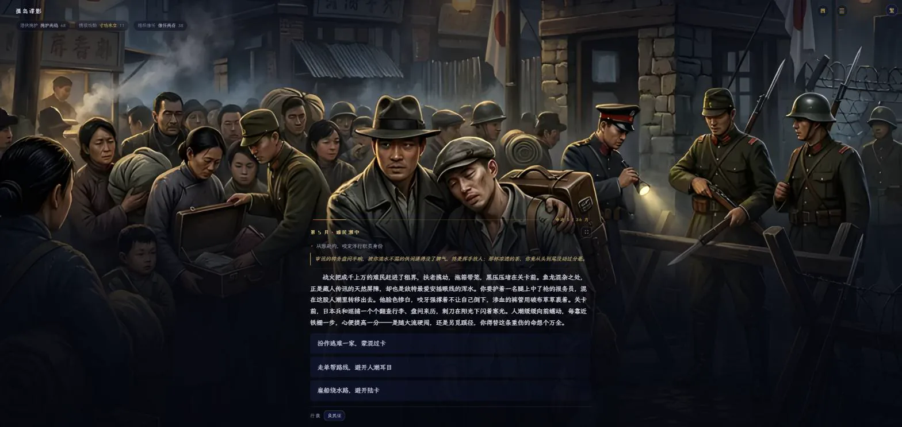

# 千世書 · thousand-lives

> AI 文字人生模擬器：一回合一次抉擇，走到屬於你的結局，免 Key 即玩

 

🎮 **[線上試玩](https://lives.newzone.top)** —— 10 個劇本 · 61 枚成就 · 純前端、免註冊 · [简体中文](README.md)

點開一個劇本，你就是那個人——宗門裡沒有靠山的散修、上海孤島上的潛伏者、廢土上剛撿回一條命的倖存者。每回合讀一段劇情、落一次子，屬性悄悄改寫你能看到的下一段故事，直到某一回合書頁停在只屬於你的結局。

## 十個劇本

每個劇本都自帶手寫事件池，**不填 API Key 也能整局玩完**：

| 劇本 | 題材 | 簡介 |
|------|------|------|
| 縹緲仙途 | 仙俠 | 凡人踏入修真之門，於宗門傾軋與雷劫心魔間求一線長生 |
| 穿書逆襲 | 穿越 | 穿成狗血虐文裡第三章就領便當的炮灰配角，親手改寫原著結局 |
| 孤島諜影 | 諜戰 | 1940 年上海孤島，在日偽、租界與重慶三方夾縫中潛伏傳情 |
| 快意江湖 | 武俠 | 提一柄缺口舊刀闖蕩江湖，從無名小卒走到一代大俠 |
| 亂世謀臣 | 三國 | 漢末群雄並起，一介謀士憑一筆一舌擇主、獻策、定鼎天下 |
| 末世求生 | 末世 | 病毒爆發後的現代廢土，三年間從苟活到重建據點、君臨一方 |
| 宦海浮沉 | 官場 | 新科進士踏入官場，於黨爭、考成與皇權之間步步為營 |
| 群星彼端 | 科幻 | 隨世代殖民艦駛向三十光年外，守護人類最後的火種 |
| 怒海爭鋒 | 航海 | 大航海時代，駕你的第一艘船在寶藏與風暴間搏一個王座 |
| 梨園浮夢 | 民國 | 民國戲園裡苦熬出頭的伶人，在亂世粉墨春秋間浮沉 |

十個之外，還可以**用一句主題讓 AI 現場生成新劇本**，或匯入別人寫好的 JSON 劇本——欄位與條件語法見 [劇本格式規範](docs/scenario-format.md)。

## 玩法亮點

- **數字即故事**：屬性按數值落入命名狀態（理智「清醒 / 動搖 / 瀕臨崩潰」），作為硬指令注入 AI——理智崩潰必現幻覺，數字改寫的是你看到的故事，不只是右上角的條
- **落子之後才揭曉**：選項不預告加減，因為擲骰、命運無常、極端命運本就會改寫它；下一段卷文裡報出這一步真正引起的增減
- **沒有被灰掉的選項**：狀態差不封鎖行動，只讓它「勉力一試」；選項之外還能自己寫一個行動，交給 AI 裁定
- **視覺小說式呈現**：整屏場景插畫為幕，卷文浮層承載劇情；一鍵「看全圖」純賞畫面，走過的回合匯成一卷命運長卷
- **結局卡 / 命運卡**：S～D 評級與專屬稱號、命運高光配圖 + 挑戰連結，一鍵分享到微博 / QQ 空間 / X / Telegram
- **61 枚成就 + 結局圖鑑**：累計記錄見過的結局，把「再開一局」變成收集

## 怎麼玩

1. 打開 **[lives.newzone.top](https://lives.newzone.top)**，挑一個劇本
2. 選**本地試玩**（免 Key，劇情來自內建事件池）或 **AI 驅動**（填 Key，大模型現場編），再選一個開局身分——身分真的決定你會遇到哪條劇情線
3. 每回合讀劇情、點一個選項，或「自己寫一個行動」；屬性到某個組合、或回合耗盡即觸發結局

想換成自己的大模型：右上角 ☰ → 設定 → 選服務商（內建 28 家預設，自動填好 Base URL 與推薦模型）→ 填 Key。

> [!TIP]
> API Key 只寫進這台瀏覽器的 `localStorage`，請求從你的瀏覽器直發服務商，不經任何中轉。詳見 [設定 AI](docs/ai-providers.md)。

## 已知限制

- **本地試玩的劇情來自手寫事件池**，同一劇本連玩幾局會撞到重複片段；要每局都不一樣得填 Key 走 AI 驅動
- **AI 驅動按你自己的 Key 計費**，且要服務商支援瀏覽器直連（CORS）；不支援的可改走 OpenRouter 這類閘道
- **存檔只在這台瀏覽器裡**（localStorage），清快取或換裝置就會丟進度
- **只有中文**（簡體 / 繁體可切），介面與劇本文本都沒做其他語言

## 文件

規範文件以簡體中文維護，內容通用：[劇本格式規範](docs/scenario-format.md)（AI 生成 · JSON 欄位 · 條件語法）· [設定 AI](docs/ai-providers.md)（28 家預設 · 三種協定 · Key 安全）· [玩法機制](docs/gameplay.md)（系統深度與技術亮點）· [開發與部署](docs/development.md)（指令 · 目錄結構 · 靜態託管）

## 授權

程式碼 [MIT](LICENSE)。隨倉庫散布的三款字型沿用各自原授權（均為 SIL OFL 1.1）：[霞鶩文楷](https://github.com/lxgw/LxgwWenKai) · [Ma Shan Zheng](https://fonts.google.com/specimen/Ma+Shan+Zheng) · [Cinzel](https://fonts.google.com/specimen/Cinzel)。

## 關於 365 開源計畫

[365 開源計畫](https://github.com/rockbenben/365opensource) 的第 **#015** 個專案——一個人 + AI，一年 300+ 個開源專案。

[提交你的需求 →](https://365.aishort.top/) · [Discord](https://discord.gg/PZTQfJ4GjX) · [Telegram](https://t.me/aishort_top)
